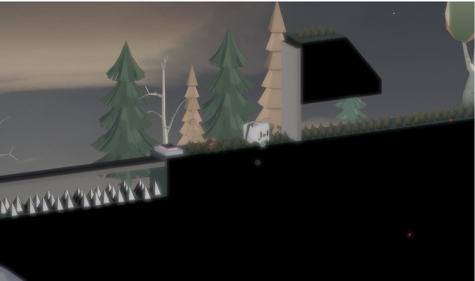
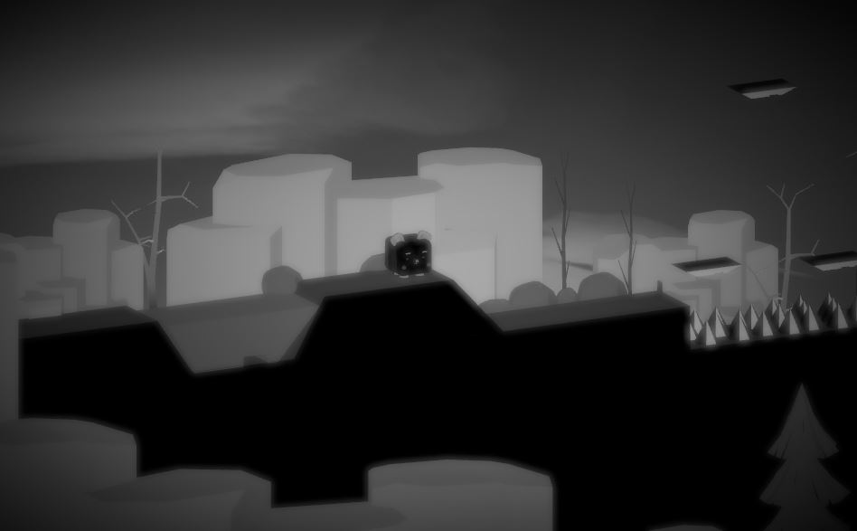
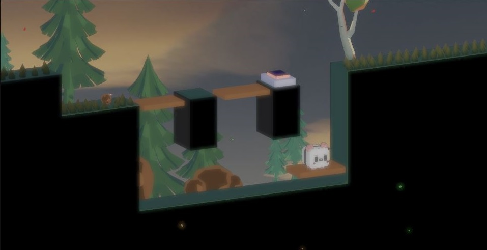

# Cuby Duby

> A two-player physics platformer about teamwork, timing, and getting through the course together.

**Gaza Sky Geeks GameJam 2025 — Winner of First Prize and Most Fun Game**

## About the Game

A heavy cube and a light sphere have to cross the course as one pair. The cube can launch the sphere, some switches only move under real weight, and others stay shut until both of them are standing on them. If one falls, they both come back.

One of you is a cube. The other is a sphere. Together you are just heavy enough, just light enough, and just stubborn enough to get through. Launch your friend, stand on the switch together, and don’t let go.

## Screenshots

### Screenshot 1

### Screenshot 2

### Screenshot 3

## Watch the Game

[Watch Cuby Duby on YouTube](https://www.youtube.com/watch?v=GHCxCLJEKj4)

## Play the Game

[Play Cuby Duby on itch.io](https://yazed-hasan.itch.io/cube-dobe)

## Follow Along

*Social media links coming soon.*
